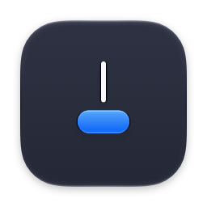
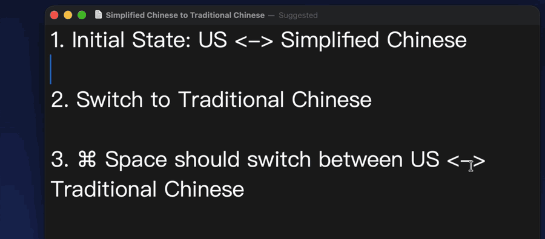

#  IMESwitch

A macOS menu bar app that switches input sources with ⌘Space in most-recently-used order, like ⌘Tab does for apps. macOS's own switching loses track of the previous input source once you have three or more.

## Install

Using [Homebrew](https://brew.sh):

```sh
brew install --cask fanzeyi/tap/imeswitch
```

Or download `IMESwitch.zip` from the [latest release](https://github.com/fanzeyi/ime-switch/releases/latest), unzip it and move IMESwitch to Applications. Releases are signed and notarized by Apple.

Requires macOS 14 Sonoma or later.

## The problem



In the recording, cycling from U.S. to 繁拼 passes through 简拼, and macOS counts that as a switch, so tapping ⌘Space afterwards toggles 繁拼 ↔ 简拼 instead of going back to U.S.

IMESwitch works like ⌘Tab: only the input source you release on counts, so the next tap goes back to U.S.

## Features

- **Tap ⌘Space** to switch to the previous input source. Tap again to come back.
- **Hold ⌘ and press Space repeatedly** to walk through all input sources in most-recently-used order, with a switcher next to the text cursor modeled on the system one. Release ⌘ to pick one. **⌘⇧Space** goes backwards, **Esc** cancels.
- **Per-source shortcuts**: give any input source its own shortcut, such as ⌃⌥1 for ABC and ⌃⌥2 for Pinyin, to jump straight to it. Shortcuts that macOS already uses are rejected.
- **Native look**: the menu bar badge matches the system one (简拼, あ, DE, РУ, …), using the labels macOS provides for each input source.
- **Show Emoji & Symbols** from the menu, in whichever app you're typing in.
- Switching any other way, such as from the menu or by clicking, also updates the most-recently-used order.
- Available in English, Simplified Chinese, Traditional Chinese and Japanese.

## Setup

On first launch, a setup window walks you through two steps and checks each one off as you go:

1. **Allow Accessibility access** in System Settings → Privacy & Security → Accessibility. IMESwitch needs it to intercept ⌘Space and to find the text cursor.
2. **Turn off the system ⌘Space shortcut** in System Settings → Keyboard → Keyboard Shortcuts → Input Sources ("Select the previous input source"), and in Spotlight if Spotlight is still on ⌘Space.

If you skip a step, the menu shows "Finish Setup…" until it's done. You can also turn on Launch at Login there or from the menu.

## Usage

| Action | Result |
| --- | --- |
| ⌘Space | Switch to the previous input source |
| Hold ⌘, press Space repeatedly | Cycle through input sources, most recent first |
| ⌘⇧Space while cycling | Cycle backwards |
| Esc while cycling | Cancel |
| Your per-source shortcut | Switch straight to that input source |

To set per-source shortcuts, choose **Configure Shortcuts…** from the menu bar icon and click the button next to an input source. A shortcut needs ⌘, ⌃ or ⌥, or can be a function key on its own. To add or remove input sources, choose **Edit Input Sources…**.

## Privacy

IMESwitch makes no network connections and collects nothing. It uses Accessibility access only to see the keys that make up its shortcuts, to find the text cursor so the switcher can appear next to it, and to open Emoji & Symbols in the frontmost app. Settings, including the most-recently-used order and your shortcuts, are stored in the app's local preferences.

## Known limitations

- **Secure input**: while a password field or a terminal's Secure Keyboard Entry is active, macOS doesn't deliver keystrokes to other apps, so ⌘Space does nothing there.
- **Third-party input methods** such as Sogou, WeType, Rime/Squirrel or Google Japanese Input are listed and switched through the same system API, but are less tested. Some of them only fully activate after focus changes, a long-standing macOS issue. Their badges fall back to the first characters of their name if they don't provide one.
- **Shortcuts taken by other apps**: shortcuts registered by other apps, such as launcher hotkeys, can't be detected. Shortcuts that use only ⌘ also override the same shortcut in every app, such as ⌘C.

## Building from source

You'll need Xcode and [XcodeGen](https://github.com/yonaskolb/XcodeGen) (`brew install xcodegen`).

```sh
git clone https://github.com/fanzeyi/ime-switch.git
cd ime-switch
make run
```

`make run` builds and launches **IMESwitch Dev**, a debug build with its own bundle ID (`fan.zeyi.IMESwitch.dev`), so it has its own Accessibility grant and settings and doesn't disturb an installed copy. Both would intercept ⌘Space, so `make run` quits the installed app. Restart it with `open /Applications/IMESwitch.app`.

### Code signing

By default the app is signed ad hoc, so you don't need an Apple developer account. The catch is that macOS ties the Accessibility grant to the signature, and an ad-hoc signature changes on every build, so you'll have to grant Accessibility again after rebuilding. To sign with your own certificate instead, create a `Local.xcconfig` at the repository root. It's ignored by git.

```
DEVELOPMENT_TEAM = ABCDE12345
CODE_SIGN_IDENTITY = Apple Development
```

### Distribution builds

`make dist` builds a universal binary signed with Developer ID, notarizes it, staples the ticket and writes `build/IMESwitch.zip`. It needs `DEVELOPMENT_TEAM` set in `Local.xcconfig`, a Developer ID Application certificate, and notarization credentials stored once in the keychain:

```sh
xcrun notarytool store-credentials IMESwitch --apple-id <apple-id> --team-id <team-id>
```

`make install` copies that build to /Applications and launches it.

## Contributing

Bug reports and pull requests are welcome, and so are new translations: add a language to `IMESwitch/Localizable.xcstrings` in Xcode. If an input source misbehaves, please include its name and ID; `defaults read com.apple.HIToolbox AppleEnabledInputSources` lists the IDs.

## License

[MIT](LICENSE)
